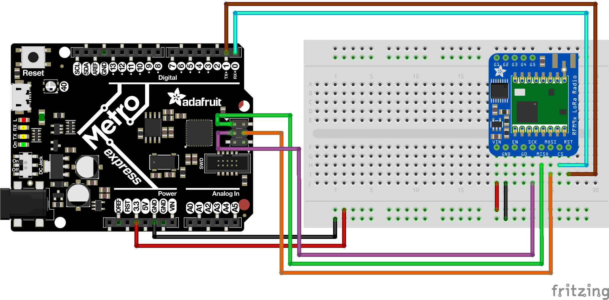

# A Complete Battery-Free Weather Station Example Project

This is a self contained example project.
It uses BFree as a battery-free weather station that periodically sends temperature and humidity data over LoRa to a constantly powered receiver.

## Metro M0 Express BFree Firmware
Contains the pre-compiled firmware `.elf` for the modified version of CircuitPython (https://github.com/TUDSSL/BFree-core/releases).
This only has to be flashed to the Metro M0 Express once.
Additionally it contains a `lib` directory of unmodified Python libraries for the specific version of CircuitPyhton used by BFree.

## BFree Shield Firmware
Contains the pre-compiled firmware `.elf` for the BFree shield's MSP430 based non-volatile memory controller.
This only has to be flashed once to the BFree shield, which can be done using an MSP430 programmer (https://www.ti.com/tool/MSP-FET)
Or (the recommended cheaper way) by using a second MSP430 Launchpad as the programmer such as this one https://www.ti.com/tool/MSP-EXP430FR5994
Which can be easily used as a programmer and debugger by removing the jumpers from the launchpad and connecting the headers to the BFree shield, as long as it has an 'eZ-FET' onboard.
Flashing can be done using Code Composer Studio (https://www.ti.com/tool/CCSTUDIO)

## Test Code
Contains a small test program that can be used to verify that BFree is correctly restoring the Python program after a power-failure.

## Receiver
Contains the Pyhthon code for the receiver that should be connected to the PC

## Battery-Free Transmitter
The BFree Python program that collects sensor data, computes the average of `N` samples, and broadcasts the result over LoRa.

